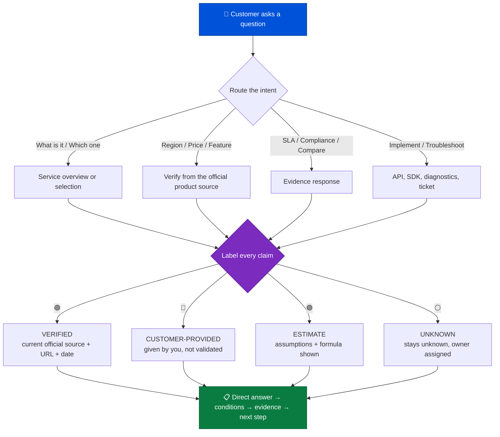

<div align="center">

# 🌏 Tencent Cloud International Advisor

**Ask about any Tencent Cloud International service — get a straight answer, official sources, and honest unknowns.**

A customer-facing WorkBuddy skill that answers from **current public official sources only**, and labels every claim it makes.

<br>


<br>

</div>

---

## ⚡ The difference

<table>
<tr>
<td width="50%" valign="top">

### ❌ A generic AI answer

> "Yes, Tencent Cloud TKE is available in Frankfurt. Standard storage costs about $0.02/GB and the SLA is 99.95%. It's cheaper than AWS for most workloads."

- Sounds confident
- **No source, no date, no edition**
- Price from model memory — **stale or wrong**
- "Cheaper than AWS" is **unprovable as stated**

</td>
<td width="50%" valign="top">

### ✅ This skill's answer

> **VERIFIED — Available with conditions.** TKE supports the Frankfurt region; confirm edition and quota for your account.
> *Source: TKE Regions documentation, accessed 2026-09-28.*

| Input | Type |
|---|---|
| Stored volume: 20 TB | `CUSTOMER-PROVIDED` |
| €0.0xx/GB-month | `VERIFIED` + URL + date |
| Monthly total ≈ €xxx | `ESTIMATE` (formula shown) |

- **Cost comparison: `UNKNOWN`** — needs a normalized PoC
- No discount or savings % promised

</td>
</tr>
</table>

---

## 💬 What customers can ask

<table>
<tr>
<td width="33%" valign="top">

**🔍 Understand**
- "What is EdgeOne, and when is it better than a plain CDN?"
- "What's the difference between CVM and Lighthouse?"

</td>
<td width="33%" valign="top">

**🧭 Choose**
- "Which service fits a live-streaming backend in SEA?"
- "Do I need TKE, or is Serverless enough?"

</td>
<td width="33%" valign="top">

**📍 Verify**
- "Is TKE available in Frankfurt?"
- "Does COS support this storage class in Singapore?"

</td>
</tr>
<tr>
<td valign="top">

**💰 Price**
- "Estimate COS for 20 TB stored + 8 TB egress in Singapore."
- "What am I actually billed for with CLB?"

</td>
<td valign="top">

**🏗️ Build & move**
- "Design a multi-region failover for my API."
- "How do I migrate from AWS to Tencent Cloud?"

</td>
<td valign="top">

**🛡️ Trust & fix**
- "Does Tencent Cloud have SOC 2 / ISO 27001?"
- "My API call fails — what should I collect?"

</td>
</tr>
</table>

---

## 🔄 How every answer is produced



---

## 🏷️ The evidence policy

| | Label | What it means | Safe to quote to a customer? |
|---|---|---|---|
| 🟢 | `VERIFIED` | A current authoritative source directly supports it | ✅ Yes — with URL, date, and scope |
| 🔵 | `CUSTOMER-PROVIDED` | You supplied it; not independently validated | ✅ As an input, with attribution |
| 🟣 | `ESTIMATE` | Calculated from explicit assumptions | ⚠️ Only with formula and range |
| ⚪ | `UNKNOWN` | Evidence missing, ambiguous, or needs official confirmation | ❌ Never converted into a claim |

> **One rule drives everything:** *not finding a feature means `Not verified`, never `Verified unavailable`.*

---

## 🚀 Install

**Option A — Upload the ZIP** *(fastest)*

Upload `tencent-cloud-international-advisor.zip` in the WorkBuddy Skills interface.

**Option B — Copy the folder**

```bash
# User scope (available in every project)
git clone https://github.com/jw-tencent/tencent-cloud-international-advisor.git \
  ~/.workbuddy/skills/tencent-cloud-international-advisor

# Project scope
git clone https://github.com/jw-tencent/tencent-cloud-international-advisor.git \
  <project>/.workbuddy/skills/tencent-cloud-international-advisor
```

The folder must contain `SKILL.md` at its root.

---

## 🧠 Try these first

```text
What is Tencent Cloud EdgeOne, and when should I use it instead of a traditional CDN?
```

```text
Is Tencent Kubernetes Engine available in Frankfurt? Cite the current product-specific source.
```

```text
Estimate monthly COS cost for 20 TB stored in Singapore and 8 TB monthly Internet egress.
Separate current official prices from my workload assumptions.
```

```text
Compare Tencent Cloud CVM and Amazon EC2 for a latency-sensitive API serving Southeast Asia.
Use each provider's official documentation and list the proof still required.
```

```text
My Tencent Cloud API call fails. Which sanitized details should I collect, and how do I open a ticket?
```

---

## 📁 Repository structure

```text
tencent-cloud-international-advisor/
├── SKILL.md                            # behavior, routing table, 10 core rules
├── README.md
├── LICENSE                             # Apache 2.0
├── workbuddy.json                      # display metadata
├── references/
│   ├── api_reference.md                # official public source map
│   ├── playbooks.md                    # 11 customer question workflows
│   ├── evidence-policy.md              # numbers, citations, claim review
│   ├── international-checklist.md      # region, data, network, commercial
│   ├── output-templates.md             # 9 customer response templates
│   └── public-release-safety.md        # what must never be published
├── scripts/
│   └── example.py
└── assets/
    └── example_asset.txt
```

---

<details>
<summary><b>🛡️ Guardrails built into the skill</b> — click to expand</summary>
<br>

| Guardrail | Why it matters |
|---|---|
| Official public sources only | No internal knowledge bases, roadmaps, or private pricing |
| Global Infrastructure ≠ product availability | The footprint page does not prove your product is in your region |
| China site ≠ International site | Pricing, quotas, and availability are validated separately |
| Never quotes price from memory | Every number carries a source URL and access date |
| Platform certification ≠ your compliance | Your workload's compliance stays your responsibility |
| Never asks for credentials | Sanitized error codes and RequestIds only |

</details>

<details>
<summary><b>❓ FAQ</b> — click to expand</summary>
<br>

**Is this an official Tencent Cloud product?**
No. It is a community skill. Public documentation, signed agreements, authorized quotes, and official support responses govern.

**Will it give me a discount or a committed price?**
No. It routes contract pricing, private offers, and discounts to an authorized account team.

**Can it tell me if my architecture is compliant?**
It can cite the exact platform certification and its scope. It will not issue a legal conclusion — that stays `UNKNOWN` for your legal owner.

**Does it need my API keys?**
Never. It never asks for SecretId, SecretKey, passwords, tokens, or private keys.

**What if it can't verify something?**
It says `UNKNOWN`, assigns an owner, and defines the validation action. It does not fill gaps from memory.

</details>

---

## 🤝 Contributing

Before adding examples, issues, or PRs, read `references/public-release-safety.md`.
Never commit credentials, customer names, internal Tencent content, contract pricing, local paths, or unsupported performance and savings claims.

---

<div align="center">

**Apache License 2.0** · See [`LICENSE`](./LICENSE)

<sub>Not an official Tencent Cloud contractual statement.</sub>

</div>
